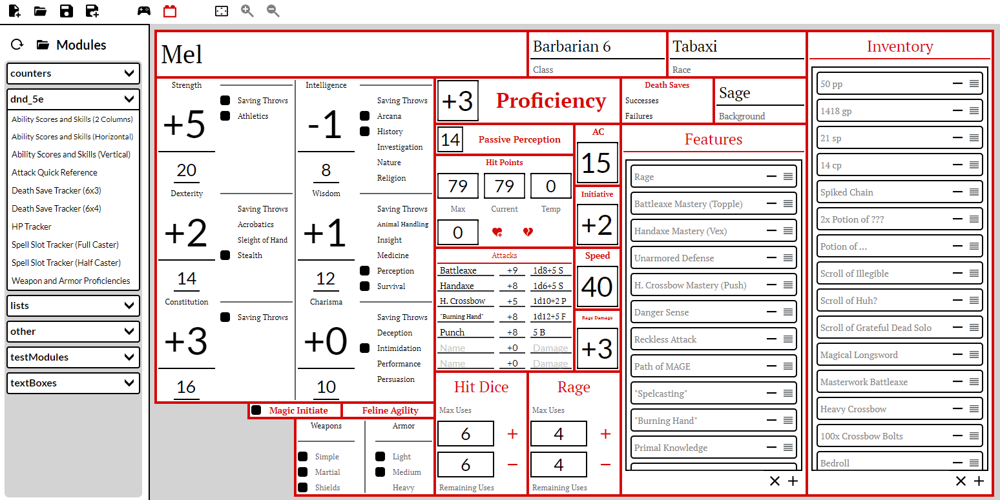

# AnySheet

AnySheet is a graphical character sheet builder for D&D, Pathfinder, and any other TTRPG system.
Every sheet is built out of modular components that you can drag and drop wherever you want. You can
even [make your own](https://github.com/JustASideQuestNPC/AnySheet/tree/main/AnySheet/AnySheet/Modules)!

**Note:** Currently, AnySheet only natively supports Windows. It *should* work if you have a way to
run Windows apps on macOS, though. Apple support is on my todo list but it'll be a while. Sorry.

## Installation
To install AnySheet:
- Download `AnySheet_Setup.exe` from the
  [latest release](https://github.com/JustASideQuestNPC/AnySheet/releases/latest).
- Run it and enjoy my *beautiful* installer.
- AnySheet won't create a desktop shortcut, but it will show up in the start menu.

## Using AnySheet
The AnySheet UI is relatively simple. At the top left are buttons for creating/opening/saving
sheets. Next to those are the buttons to switch between Gameplay and Sheet Builder modes
(alternatively, press Ctrl+G or Ctrl+B). In Gameplay mode, you can edit what's in the modules in
your character sheet. In Sheet Builder mode, you can add new modules, remove existing modules, and
drag modules to reposition them.

On the left is the module sidebar, which is only visible in Sheet Builder mode. It shows every the
name of every module you can add, organized by folder. To add a module, just click its name. To
remove a module, right-click it and select "Remove".

You can drag the camera by clicking and zoom by holding Shift and scrolling. **Note:** In Sheet
Builder mode, you can only drag the camera by right-clicking. This is intentional to avoid issues
when dragging modules around.

## Known Issues
AnySheet is *very* much a work in progress, and there's a few quirks that I know about now that I
haven't fixed yet:
- The "unsaved changes will be lost" popup appears whenever you close the app, regardless of whether
  you have any unsaved changes to use. Your sheet is still saved just fine.
- Some parts of modules (mainly buttons) are invisible when in Sheet Builder mode.
- Zooming is disabled in Sheet Builder mode. This isn't a bug, it's just been disabled because I'm
  bad at math and can't get modules to align correctly.