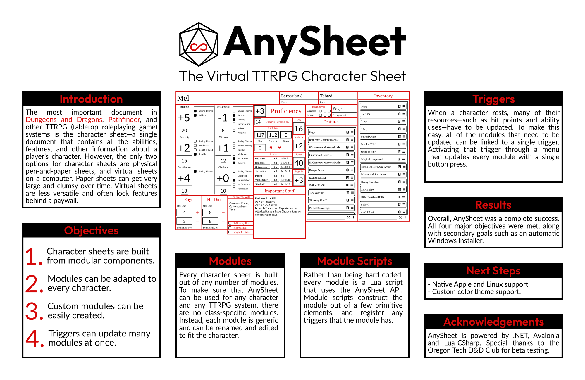

AnySheet is a graphical character sheet builder for D&D, Pathfinder, and any other TTRPG system.
Every sheet is built out of modular components that you can drag and drop wherever you want. You can
even [make your own](https://github.com/JustASideQuestNPC/AnySheet/tree/main/AnySheet/AnySheet/Modules)!

**Note:** Currently, AnySheet only natively supports Windows. It *should* work if you have a way to
run Windows apps on macOS, though. Apple support is on my todo list but it'll be a while. Sorry.

## Installation
To install AnySheet:
- Download `AnySheet_Setup.exe` from the
  [latest release](https://github.com/JustASideQuestNPC/AnySheet/releases/latest).
- Run it and click through the installer.
- Profit.

If you're a developer and want to build from source, go [here](#building-from-source).

## Using AnySheet
The AnySheet UI is relatively simple. At the top left are buttons for creating/opening/saving
sheets. Next to those are the buttons to switch between Gameplay, Sheet Builder, and Trigger Editor
modes. In Gameplay mode, you can edit what's in the modules in your character sheet.

In Sheet Builder mode, you can add new modules, remove existing modules, and drag modules to
reposition them. The module sidebar on the left shows every avaliable module, organized by folder.
To add a module, just click its name in the sidebar. To move modules around, left-click them and
drag. To remove a module from your sheet, right-click it and select "Remove".

In Trigger Editor mode, you can add and setup triggers that updata multiple modules at once.
Triggers will appear on the sidebar (sheets have no triggers by default; use the text box at the
bottom to create one). To edit a trigger, click the pencil icon next to its name, then right-click
modules on your sheet to show and toggle whatever triggers it has.

You can drag the camera by clicking and zoom by holding Shift and scrolling. **Note:** In Sheet
Builder mode, you can only drag the camera by right-clicking. This is intentional to avoid issues
when dragging modules around.

## Known Issues
AnySheet is still sort of a work in progress, and there's a few quirks that I know about but haven't
fixed yet:
- The "unsaved changes will be lost" popup appears whenever you close the app, regardless of whether
  you have any unsaved changes to use. Your sheet is still saved just fine.
- Some parts of modules (mainly buttons) are invisible when in Sheet Builder mode.
- Zooming is disabled in Sheet Builder mode. This isn't a bug, it's just been disabled because I'm
  bad at math and can't get modules to align correctly.

## Building From Source
To build from source (if you used the installer, you can ignore this):
- Pull the repo.
- Open the project file (`AnySheet/AnySheet.sln`) in your IDE of choice.
- Make these changes to the run configuration for `AnySheet`:
  - Set the working directory to the same directory as the modules folder.
  - Pass the path to the crash handler as a command-line argument. From the working directory, the
    default relative path is `../CrashHandler/bin/Release/net9.0/CrashHandler.exe`. Alternatively,
    use `--nocrashhandler` to disable the crash handler entirely.